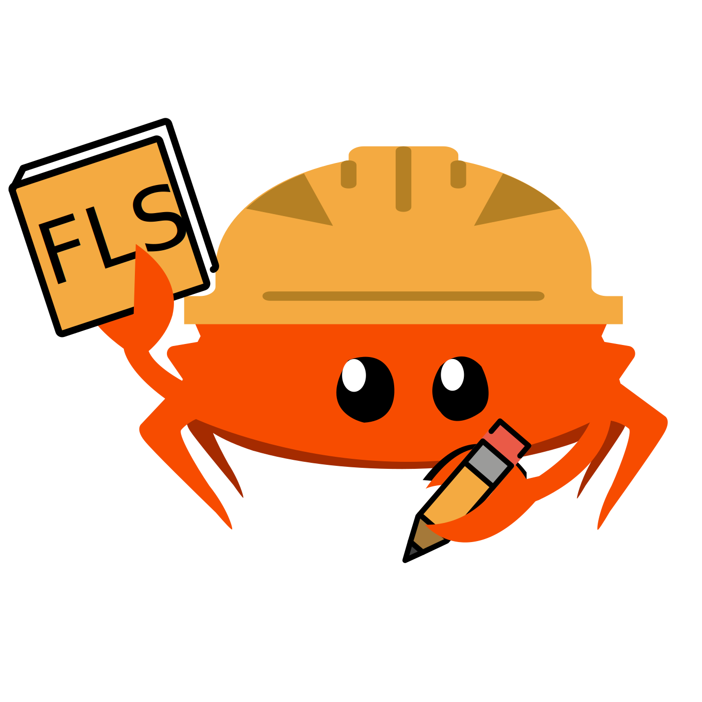

# The FLS Team - `t-fls`

Welcome to the [`t-fls`](https://rust-lang.org/governance/teams/lang/#team-fls) repo!

## Charter

Back in May 2025, we [adopted](https://blog.rust-lang.org/2025/03/26/adopting-the-fls/)
the FLS into the Project. It's now time to create a team charged with maintaining and
improving this document.

Our charter is, in a nutshell, to shepherd the FLS maintenance and development. For a
more detailed treatment, see the [charter](./CHARTER.md).
